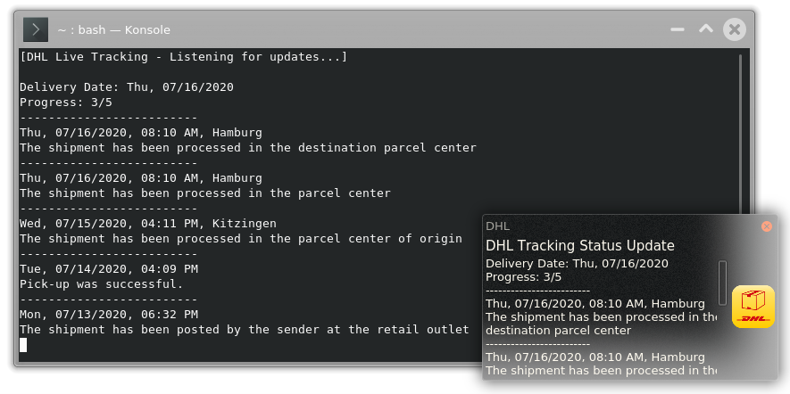
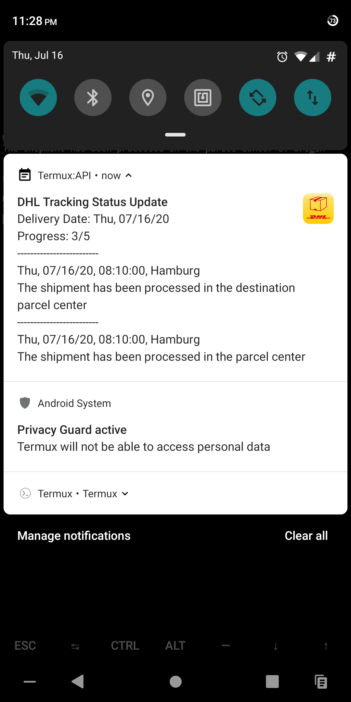

## Installation

### Linux and Mac OS
```
# Download the DHL script
wget https://raw.githubusercontent.com/T-vK/DHL-Open-Source-Push-Notifications/master/dhl
# Make it executable
chmod +x dhl
# Copy it into a folder found in $PATH
# (Use echo $PATH to get a colon separated list of viable folders)
```

### Android
- Install the (open source) apps Termux and Termux:API
- Open Termux and type the following and press enter:

``` Bash
pkg i -y termux-api curl wget jq
wget -O "$PREFIX/bin/dhl" https://raw.githubusercontent.com/T-vK/DHL-Open-Source-Push-Notifications/master/dhl
chmod +x "$PREFIX/bin/dhl"
```

## CLI Documentation

```
usage: dhl [OPTIONS]... <TRACKING_ID>
Show detailed tracking status the given DHL tracking ID.

  -l, --live           Track the parcel in real time with push notifications
```

## Example for real-time live tracking

``` Bash
dhl --live 1234567890
```

## Example for getting the tracking status once

``` Bash
dhl 1234567890
```

## Screenshots



